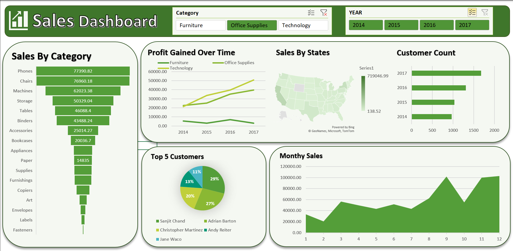

# Sales Dashboard in Excel

This project is an **interactive Sales Dashboard** built entirely in **Microsoft Excel**.
It transforms a raw sales dataset into a easy-to-understand tool for quick business analysis.

---

##  Key Features

* **Technology**: Microsoft Excel 
* **Data Transformation**: Cleaned and structured raw data using **PivotTables**
* **Interactive Visuals**:

  * Funnel Chart → *Sales by Sub-Category*
  * Line Chart → *Profit Over Time*
  * Area Chart → *Monthly Sales Trends*
  * Bar Chart → *Top 5 Customers by Profit*
  * Map Chart → *Sales by State*
* **Slicers & Filters**: Filter instantly by **Year** and **Product Category** (Furniture, Technology, etc.)

---

## 🎯 Project Goal

To deliver **actionable business insights** by answering:

* How have **sales & profit** trended over the years?
* Which **sub-categories** perform best?
* Who are the **most valuable customers**?
* How does performance vary by **region**?

---

## 📊 Skills Demonstrated

* Data Cleaning & Transformation
* PivotTables & Slicers
* Dashboard Design & Visualization
* Business Analysis with Excel

---

## 📷 Preview

* Overall Data :
  

  
  

* Furnitures :
  

* Office Supplies :
  

* Technology :
  

---

##  How to Use 

1. Download the Excel file from this repository
2. Open in Microsoft Excel/ Google Sheets
3. Use slicers to explore and filter the dashboard

---
